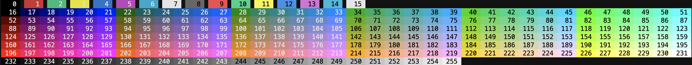

# Colorx

Simple terminal app to display colors in terminal according to wikipedia page:
https://en.wikipedia.org/wiki/ANSI_escape_code#8-bit

### Install
Run following command:
```
go install github.com/dankox/colorx
```

Or clone this repo and just run it using `go run`:

### Run

```
colorx
```
Output in the terminal:

